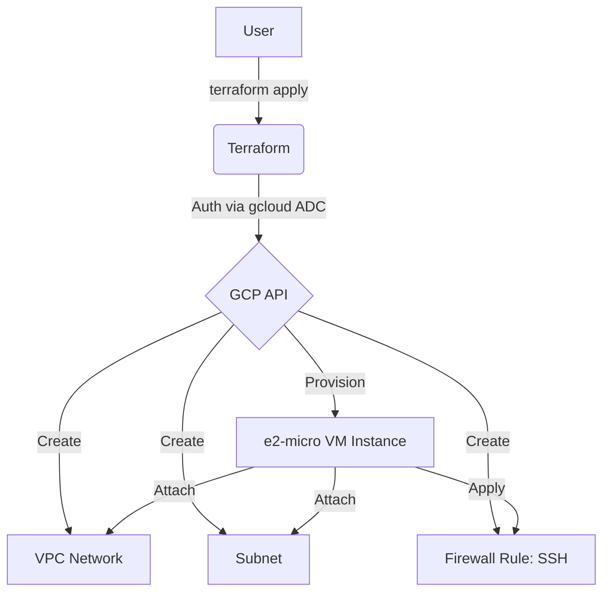
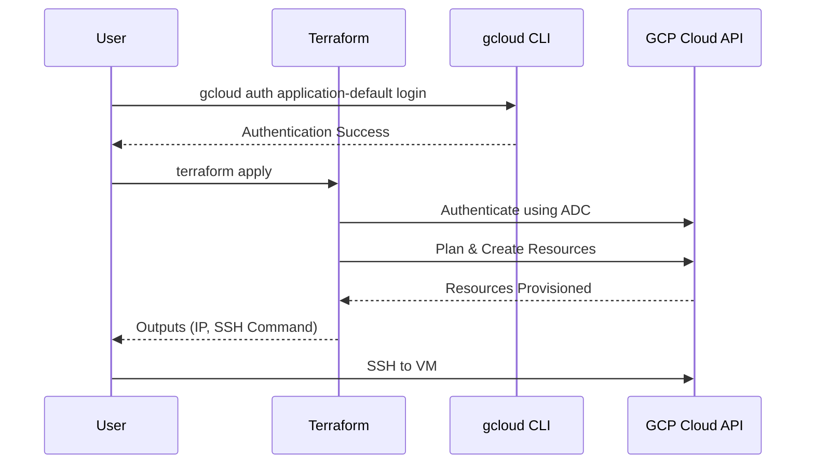

# terraform-gcp-virtual-machine

This Terraform project provisions a Google Cloud Platform (GCP) virtual machine instance.

## Architecture

### Flowchart


### Sequence Diagram


## Instance Specifications
- **Machine Type**: `e2-micro` (2 vCPUs, 1 GB RAM).
- **Regions**: `us-west1`, `us-central1`, or `us-east1`.
- **Disk**: 30 GB standard persistent disk (`pd-standard`).
- **External IP**: One non-preemptible external IP address.

## Prerequisites
1.  **Google Cloud SDK**: [Installed and initialized](https://cloud.google.com/sdk/docs/install).
2.  **Terraform**: [Installed](https://developer.hashicorp.com/terraform/downloads).

## Setup & Deployment

1.  **Authenticate and Select Project**:
    Instead of using a service account JSON file, this project uses your local `gcloud` credentials.
    ```bash
    # Authenticate
    gcloud auth application-default login

    # Select your project
    gcloud config set project your-project-id
    ```

2.  **Configure Variables**:
    Create a `terraform.tfvars` file based on the example:
    ```hcl
    project_id = "your-project-id"
    region     = "us-central1"
    zone       = "us-central1-a"
    ssh_user   = "gcp-user"
    ```

3.  **Deploy**:
    ```bash
    terraform init
    terraform apply
    ```

4.  **Connect**:
    Use the `ssh_connection_command` provided in the output.

## Usage as a Module

Reference this repository as a Terraform module in your own configurations:

> **Option 1**: Terraform Registry (recommended)
> ```hcl
> module "virtual-machine" {
>   source  = "marcuwynu23/virtual-machine/gcp"
>   version = "1.0.0"
>
>   project_id    = var.project_id
>   region        = "us-central1"
>   zone          = "us-central1-a"
>   instance_name = "my-app-vm"
>   ssh_user      = "gcp-user"
> }
> ```
>
> **Option 2**: GitHub source
> ```hcl
> module "virtual-machine" {
>   source = "github.com/marcuwynu23/terraform-gcp-virtual-machine?ref=main"
>
>   project_id    = var.project_id
>   region        = "us-central1"
>   zone          = "us-central1-a"
>   instance_name = "my-app-vm"
>   ssh_user      = "gcp-user"
> }
> ```

## Variables

| Variable | Description | Type | Default |
|----------|-------------|------|---------|
| `project_id` | GCP project ID | `string` | (required) |
| `region` | GCP region (free tier: us-west1, us-central1, us-east1) | `string` | `"us-central1"` |
| `zone` | GCP zone | `string` | `"us-central1-a"` |
| `instance_name` | VM instance name | `string` | `"free-tier-vm"` |
| `ssh_user` | SSH username | `string` | `"gcp-user"` |

## Outputs

| Output | Description |
|--------|-------------|
| `vm_external_ip` | External IP address of the VM |
| `vm_internal_ip` | Internal IP address of the VM |
| `ssh_connection_command` | SSH connection command |
