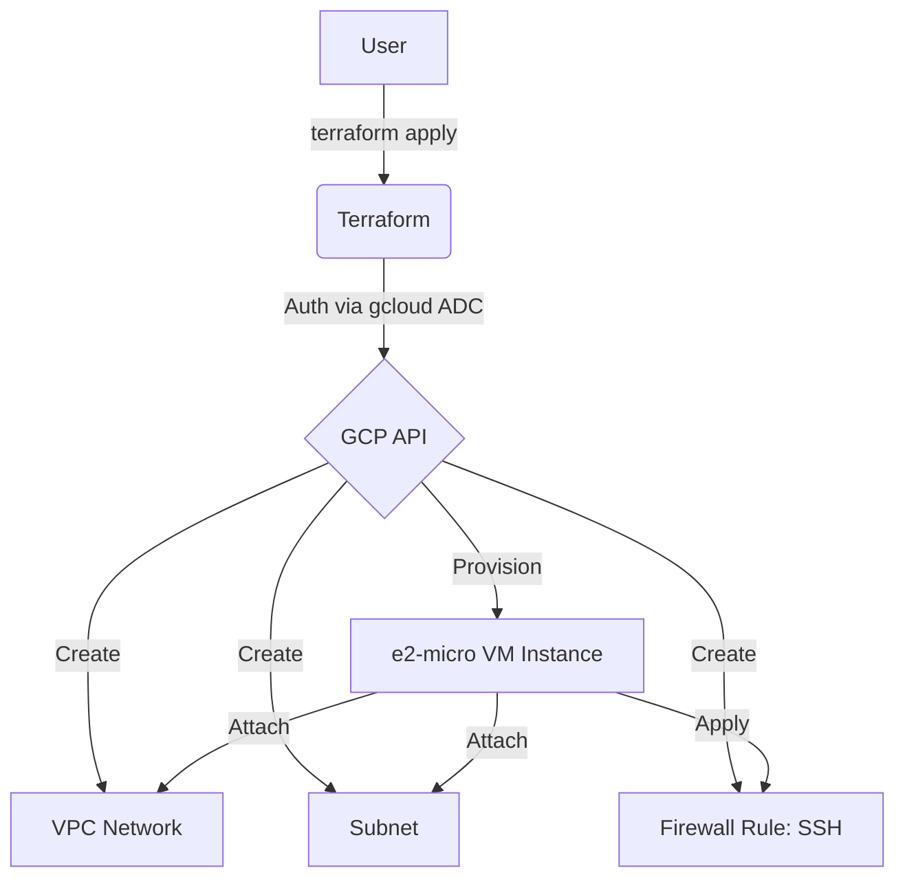
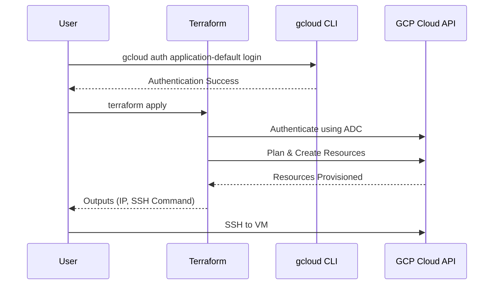

# terraform-gcp-virtual-machine

This Terraform project provisions a Google Cloud Platform (GCP) virtual machine instance.

## Architecture

### Flowchart


### Sequence Diagram


## Instance Specifications
- **Machine Type**: `e2-micro` (2 vCPUs, 1 GB RAM).
- **Regions**: `us-west1`, `us-central1`, or `us-east1`.
- **Disk**: 30 GB standard persistent disk (`pd-standard`).
- **External IP**: One non-preemptible external IP address.

## Prerequisites
1.  **Google Cloud SDK**: [Installed and initialized](https://cloud.google.com/sdk/docs/install).
2.  **Terraform**: [Installed](https://developer.hashicorp.com/terraform/downloads).

## Setup & Deployment

1.  **Authenticate and Select Project**:
    Instead of using a service account JSON file, this project uses your local `gcloud` credentials.
    ```bash
    # Authenticate
    gcloud auth application-default login

    # Select your project (e.g., gcloud config set project test)
    gcloud config set project gen-lang-client-xxxxxx
    ```

2.  **Configure Variables**:
    Create a `terraform.tfvars` file based on the example:
    ```hcl
    project_id = "gen-lang-client-xxxxxx"
    region     = "us-central1"
    zone       = "us-central1-a"
    ssh_user   = "gcp-user"
    ```

3.  **Deploy**:
    ```bash
    terraform init
    terraform apply
    ```

4.  **Connect**:
    Use the `ssh_connection_command` provided in the output.
